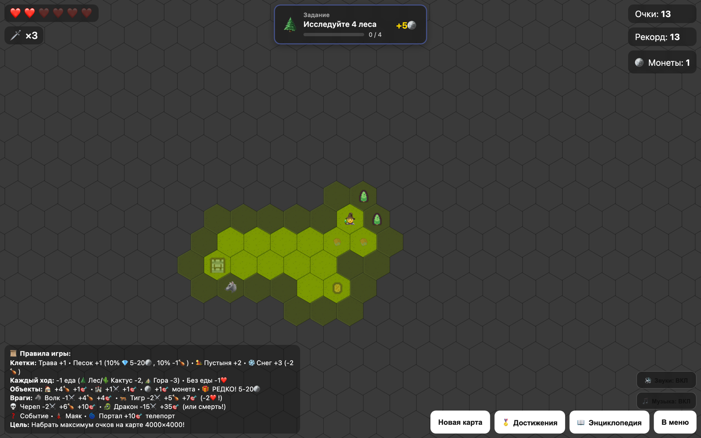

[English](README.md) · **Русский**

# Hex Quest

Пошаговое исследование бесконечной гексагональной карты. Всё поле закрыто туманом; каждый клик открывает соседнюю клетку и сразу разыгрывает то, что под ней. Задача — набрать как можно больше очков, пока не кончились здоровье и еда.

## Правила

Три ресурса: **здоровье** (6 сердец, восстановить нельзя), **еда** и **мечи**. Еда убывает каждый ход — стоять на месте не выйдет.

| Клетка | Что делает |
|---|---|
| Трава, песок | Переход, +1 очко; в песке иногда попадаются самоцветы |
| Пустыня, снег | +2 и +3 очка, но снег стоит еды |
| Вода | Непроходима, только открывается |
| Лес, кактус, гора | Очки за счёт еды: +2, +2, +3 |
| Дом | +4 еды, одноразово |
| Замок | +1 меч |
| Волк, тигр, череп, дракон | Бой мечами: чем опаснее враг, тем больше очков и риск |
| Монета, сундук, маяк, портал | Монеты, редкая крупная награда, телепорт |

Очки за клетку дают один раз — это заставляет всё время идти в новое, а не топтаться по открытому. Ходить можно только на соседей уже открытых клеток.

## Что ещё внутри

- **Карта 4000×4000** с ленивой генерацией: тайлы считаются по мере подхода, не рисуется весь мир сразу.
- **Ландшафт вместо случайности** — лес и горы растут группами, вода собирается в озёра, снег и пустыня образуют биомы, а враги и постройки стоят поодиночке.
- **Инвентарь и снаряжение** — карта, зелья, камень телепортации, паки еды и мечей, метка охотника, железная броня, тёплые сапоги, шлем святого, меч, булава, волчий лук. Одни расходуются, другие меняют правила, пока надеты.
- **Прокачка между забегами** — за монеты растут слоты инвентаря, запас здоровья, стартовая еда и мечи.
- **Море и его обитатели** — корабли, акулы, осьминог с отдельной сценой боя; феникс и бутылка с посланием как редкие находки.
- **Задания** — «исследуйте 4 леса», «покорите 5 гор»; за выполнение растущая награда монетами.
- **15 персонажей за монеты** — маг, берсерк, коллекционер, драконоборец, русалка, феникс, медведь, демон, вампир, робот, пришелец и другие; у каждого своя способность, меняющая правила.
- Достижения, таблица лидеров, энциклопедия объектов, случайные события с выбором, режим с текстурами и без.
- Музыка по умолчанию выключена, звуки включены — переключается кнопками в меню и в игре.

## Запуск

Откройте `index.html` в браузере. Звуки лежат в `Sounds/`, иконки — в `Icons/`.

## Стек

Один HTML-файл: canvas, чистый JS, без библиотек.
